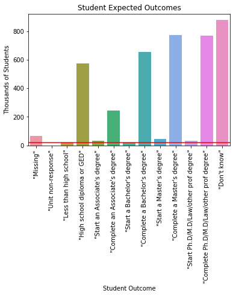

## Exploratory Data Analysis

Questions to answer:
- What are the proportions of real student outcomes?
- What are student's beliefs in their educational attainment?
- What is the distribution of math scores?
- What are some common problems at the schools, and what do Principals think of them?
- Are there any interesting variables that can be tracked over all four survey points?


A major component of answering quantitative questions with this data set is the use of weights and replicate weights to convert the given data to data that is representative of the population. The data set is collected using complex sampling, meaning that each student in the US is not equally likely to be selected for the study. 

The sample was constructed so that major groups of interest, like public/private schools or students from different socio-economic backgrounds, were all represented within the study while minimizing the resource to implement the study. In addition, some schools selected, and students within the selected schools, did not participate in the study. To account for these effects, weights are provided within the data set to convert raw statistics into statistics that are representative of the US population.

For each group of respondents, such as students or school counselors, and each collection timeframe, a weight is given for caclulating statistics such as a mean, that should multiply the contribution of each student record. Similarly, for each group of student respondents and each collection timeframe, a group of 200 replicate weights is given to calculate the variance. The statistic is calculated 200 times with the varying sets of weights, and so the variance of the statistic can be accurately stated. 

Without including weights, statistics and variance in those statistics would be subject to large biases due to over-representation of certain groups in the sample and non-response bias.


```python
#load packages
import numpy as np
import pandas as pd
import matplotlib.pyplot as plt
import seaborn as sns
%matplotlib inline
```


```python
#Import data set from last notebook
filepath = '/Users/chrismalec/DS_Portfolio/CapstoneProjectOne/'
studentdatafile = 'HSLS_2016_v1_0_CSV_Datasets/hsls_16_student_v1_0.csv'

df_BY = pd.read_pickle(filepath + 'df_BY.pkl')
df_F1 = pd.read_pickle(filepath + 'df_F1.pkl')
df_F2 = pd.read_pickle(filepath + 'df_F2.pkl')
df_F3 = pd.read_pickle(filepath + 'df_F3.pkl')
df_weights = pd.read_pickle(filepath+'df_weights.pkl')
```


```python
import pickle
pickle_in = open(filepath+'number_labels.pkl',"rb")
number_labels = pickle.load(pickle_in)
```


```python
#Example for column X1TXMTH: Mathematics theta score, first with no weight
avg_theta_score = (df_BY['X1TXMTH']).mean()
a_weight = df_weights['W1MATHTCH']
sum_aweight = a_weight.sum()
estimate = df_BY['X1TXMTH'].multiply(a_weight).sum()

print('Without weights, the average is ',round(avg_theta_score,3),
      ' while with weights the average is ',round(estimate/sum_aweight,3))
```

    Without weights, the average is  -0.669  while with weights the average is  -0.05


I would like to avoid writing this code over and over again, and calculating the variance using replicate weights is even another step. There are two distinct actions I will probably have to take, one to calculate a statistic from numeric data, and one to sum counts for categorical data. The following two functions estimate a statistic or a count for a particular column of data.


```python
def estimate_statistic(column,df_data,weight,df_weight,func = np.sum,normalize = False):
    replicate_weight_list = [weight +'{:03d}'.format(x) for x in range(1,201)]
    analytic_weight = df_weight[weight]
    replicate_weights = df_weight[replicate_weight_list]
    sum_analytic_weight = analytic_weight.sum()
    if(normalize == False):
        sum_analytic_weight = 1
        
    estimate = func(df_data[column].multiply(analytic_weight))/sum_analytic_weight
    
    replicate_estimates = np.empty(len(replicate_weight_list))
    for i,w in enumerate(replicate_weights.columns):
        replicate_estimate = func(df_data[column].multiply(replicate_weights[w]))/sum_analytic_weight
        replicate_estimates[i] = replicate_estimate
    
    variance = ((replicate_estimates - estimate)**2).sum()/(len(replicate_weight_list)-1)
    stdev = np.sqrt(variance)
    return (estimate, stdev)
```


```python
def estimate_count(column,df_data,weight,df_weight,code_dict):
    replicate_weight_list = [weight +'{:03d}'.format(x) for x in range(1,201)]
    df_agg = pd.concat([df_data[column].astype('int64',errors = 'ignore'),df_weight[[weight]+replicate_weight_list]],axis=1)
    df_agg = df_agg.groupby(column).sum()
    df_estimate_variance = pd.DataFrame(data={'category':[],'estimate':[],'std dev':[]})
    #For some reason, some numeric variable labels are floats instead of integers, may fix this is cleaning stage.
    for i, row in df_agg.iterrows():
        #double check std estimation here
        estimate = df_agg.loc[i,weight]
        variance = ((df_agg.loc[i,replicate_weight_list] - estimate)**2).sum()/(len(replicate_weight_list)-1)
        df_estimate_variance.loc[i] = [code_dict[str(round(i))],
                                       estimate,
                                       np.sqrt(variance)]
    
    return df_estimate_variance
```

## What are the real student outcomes?

The labels for this data set come from the second followup/transcript collection phase of the study since this is the most comprehensive and reliable information. The good news is that most students graduate high school, however it makes the other categories difficult to see, so a graph with 'Fall 2012 - Summer 2013 graduate' and 'Status cannot be determined' removed is also shown. We can see that 'dropped out' is only about 20,000 students of over 4 million. 'Graduation date unknown' and 'Status cannot be determined' merit further investigation.


```python
#What are the proportions of real student outcomes?
df_temp = estimate_count('X3TOUTCOME',df_F2,'W3STUDENTTR',df_weights,number_labels['X3TOUTCOME'])
df_temp['estimate'] = df_temp['estimate']/1000
df_temp = df_temp.sort_values('estimate')

fig = plt.figure(figsize = [12,6])
fig.subplots_adjust(wspace=0.9)

ax1 = fig.add_subplot(1,2,1)
ax1 = sns.barplot(x = 'category',y='estimate',data = df_temp)
for item in ax1.get_xticklabels():
    item.set_rotation(90)
ax1 = ax1.set(title='Student Outcomes Reported on 2013 Transcript',
       xlabel='Student Outcome',
       ylabel='Thousands of Students')

keep_cats = [2,3,4,5,6,7,8,9]
ax2 = fig.add_subplot(1,2,2)
ax2 = sns.barplot(x='category',y='estimate',data = df_temp.iloc[keep_cats,:])
for item in ax2.get_xticklabels():
    item.set_rotation(90)
ax2 = ax2.set(title='Student Outcomes Reported on 2013 Transcript',
       xlabel='Student Outcome',
       ylabel='Thousands of Students')

plt.show()
```


## What do students believe their educational attainment will be?

Belief is a powerful thing. Believing you will succeed is not sufficient to success, but it is necessary. Here we see that the number of students who believe that they will complete 'less than high school' is tiny, much smaller than the 'dropped out' count. A great number are under 'don't know', which is a reasonable response for someone who is 14-15. This says to me that students generally do not plan on dropping out.

I also see that most people really believe in their own follow-through, as 'start a(n) X degree' are all much lower counts than 'finish a(n) X degree'.


```python
#What are student's beliefs in their educational attainment?
df_temp = estimate_count('S1EDUEXPECT',df_BY,'W1STUDENT',df_weights,number_labels['S1EDUEXPECT'])
df_temp['estimate'] = df_temp['estimate']/1000
ax1 = sns.barplot(x = 'category',y='estimate',data = df_temp)
for item in ax1.get_xticklabels():
    item.set_rotation(90)
ax1 = ax1.set(title='Student Expected Outcomes',
       xlabel='Student Outcome',
       ylabel='Thousands of Students')
plt.show()
```





## What is the distribution of mathematics scores

In my personal experience, math can be a breaking point for a lot of students, and achievement gaps are wider than for other subjects. This particular study collected information about math and science classes and teachers, so I wanted to look at some aspect of this data. The standardized theta score presented here is supposed to present some measure of a student's math level.

To see a distribution, I have to weight the data at the level of the histogram, so that a particular score is given the correct count.

From the graph, I can see that this particular measure is calibrated so that '0' represents a fairly average math student. It is not a normal distribution, however the variations in math scores on this scale are smooth, with many students represented at every level. Still, trying to work with students coming from many levels is a challenge for teachers in any subject.


```python
scores = df_BY['X1TXMTSCOR']
weights = df_weights['W1MATHTCH']
min_score = scores.min()
max_score = scores.max()
_ = plt.hist(scores, bins = 100, weights=weights,range = (min_score,max_score))
_ = plt.xlabel('Mathematics standardized theta score')
_ = plt.ylabel('Student count')
_ = plt.title('Distribution of freshman mathematics scores')
plt.show()
```


## What does administration think about problems at the school?

Leadership matters, and I was curious about what administration thinks the biggest problems at various schools are. I think in this case the 'school' data table may be more appropriate, as this only includes one admin response for each school. Because of how the data is anonymized, I cannot aggregate by school for the student level data. These responses therefore represent student experience more than proportion of admins with various beliefs. This means that if one admin believes that tardiness is not a problem, but an admin at another school that has 10x more students believes tardiness is a problem, this means that 10x more students attend a school where administration believes tardiness is a problem.


```python
#What are some common problems at the schools, and what do Principals think of them?
#Create a list of variable names where 'is a problem' is in the description, I only chose the admin's opinion here.
problem_desc = []
problem_labels = []
for key, value in number_labels.items():
    if 'desc' in value.keys():
        if ('is a problem' in value['desc']) & (key[0:2] == 'A1'):
            if value['desc'][8:] not in problem_desc:
                problem_desc.append(value['desc'][8:])
            if key[0] == 'A':
                problem_labels.append(key)

print('Some possible problems include:')
for problem in problem_desc:
    print(problem)
```

    Some possible problems include:
    Student tardiness is a problem at this school
    Teacher absenteeism is a problem at this school
    Student apathy is a problem at this school
    Lack of parental involvement is a problem at this school
    Students coming unprepared to learn is a problem at this school
    Poor student health is a problem at this school
    Lack of teacher resources and materials is a problem at this school


```python
df_graphs = []
for problem in problem_labels:
    df_temp = estimate_count(problem,df_BY,'W1STUDENT',df_weights,number_labels[problem])
    df_temp['estimate'] /= 1000
    df_temp['problem'] = problem
    df_graphs.append(df_temp)
df = pd.concat(df_graphs)
order = df[df['problem']=='A1TARDY']['category']
g = sns.FacetGrid(data = df, col = 'problem',col_wrap = 4)
g = g.map(sns.barplot,"estimate","category",order = order)
axes = g.axes.flatten()
axes[3].set_xlabel('Thousands of Students')
axes[4].set_xlabel('Thousands of Students')
axes[5].set_xlabel('Thousands of Students')
axes[6].set_xlabel('Thousands of Students')
axes[0].set_ylabel('Seriousness')
axes[4].set_ylabel('Seriousness')
for i,ax in enumerate(axes):
    ax.set_title(number_labels[problem_labels[i]]['desc'][8:-28])
plt.show()
```


## Are there any interesting variables that span multiple years in the study?

I would like to know which variables measure the same thing over multiple years. It turns out that only very generic information such as 'locale' of the student is carried across all four collection times. There are a number of interesting variables that were collected in all followups, including whether or not a student has ever dropped out.


```python
#Take advantage of set operations to make comparisons easy
Long_var = dict({'1':set(),'2':set(),'3':set(),'4':set()})
for key,value in number_labels.items():
    temp = list(key)
    time = temp.pop(1)
    if time not in Long_var.keys():
        continue
    Long_var[time].add(''.join(temp))

Long_var_14 = Long_var['1'].intersection(Long_var['2'],Long_var['3'],Long_var['4'])
Long_var_24 = Long_var['2'].intersection(Long_var['3'],Long_var['4'])
Long_var_12 = Long_var['1'].intersection(Long_var['2'])
print('Variables carried across all four collection times:')
for item in Long_var_14:
    orig_key = item[0]+'1'+item[1:]
    print(number_labels[orig_key]['desc'])
print('')

print('Variables carried across all three followup collection times:')
for item in Long_var_24:
    orig_key = item[0]+'2'+item[1:]
    print(number_labels[orig_key]['desc'])
print('')

print('Variables carried across base year (freshman) and first followup (junior):')
for item in Long_var_12:
    orig_key = item[0]+'1'+item[1:]
    if 'desc' in number_labels[orig_key].keys():
        print(number_labels[orig_key]['desc'])
print('')
```

    Variables carried across all four collection times:
    X1 Student questionnaire status
    X1 School control
    X1 School locale (urbanicity)
    X1 School geographic region
    X1 Student questionnaire date (YYYYMM)
    
    Variables carried across all three followup collection times:
    X2 Ever dropout
    S2 C26B Importance of cost of attendance when choosing college/school
    X2 Student questionnaire status
    S2 A07B Year teenager last attended high school
    S2 A06B Year teenager received diploma/GED/alternative credential
    X2 School locale (urbanicity)
    X2 School control
    S2 C26A Importance of academic quality/reputation when choosing college/school
    X2 School geographic region
    X2 Student questionnaire date (YYYYMM)
    S2 A05 Teenager has earned a high school credential
    X2 Sample member status in BY and F1 rounds
    
    Variables carried across base year (freshman) and first followup (junior):
    P1 C01 Parent 1's highest degree earned
    C1 A14 School shares students' career/education plans with their parents
    S1 C06C 9th grader thinks fall 2009 math course is boring
    S1 D05J 9th grader is taking fall 2009 science b/c needs it for career
    X1 Father/male guardian's current/most recent occupation: STEM code 1 (sub-domain)
    X1 Parent 1: current/most recent occupation: 2-digit ONET code
    X1 Imputation flag for X1MOMEMP
    P1 E06C Participated in religious group outside of school in last year
    A1 A25B Partners w/ college/university that offers math/science summer program
    S1 C05H 9th grader is taking fall 2009 math b/c needs it to get into college
    X1 How far in school 9th grader thinks he/she will get
    X1 Mathematics IRT-estimated number right score (of 72 base year items)
    P1 D02I Ninth grader repeated 8th grade
    X1 Father/male guardian's relationship to 9th grader
    X1 Imputation flag for X1HHNUMBER
    X1 Imputation flag for X1MOMEDU
    A1 A25D Pairs students with mentors in math or science
    S1 D11I 9th grader's fall 2009 science teacher makes science easy to understand
    X1 P1-P2 relationship pattern
    A1 E17I Poor student health is a problem at this school
    X1 SES derived with locale (urbanicity) - multiple imputation value 3 of 5
    X1 Scale of student's science self-efficacy
    X1 Student occupation at age 30: 2-digit ONET code
    X1 Imputation flag for X1DADOCC2
    S1 C05K 9th grader is taking fall 2009 math b/c it was assigned
    X1 Imputation flag for X1PAREDU
    X1 Whether parent questionnaire respondent is mother
    X1 Socio-economic status composite
    P1 G02B Other family member helped respondent complete questionnaire
    S1 E03 9th grader's favorite school subject
    S1 C01A 9th grader sees himself/herself as a math person
    P1 D02F Ninth grader repeated 5th grade
    P1 A05 Respondent has a spouse/partner who lives in household
    X1 Scale of student's science identity
    P1 B16 Year Parent 2 came to U.S. to stay
    P1 C07 Hours Parent 1 works/worked per week
    X1 Mother's/female guardian's highest level of education
    P1 C15 Hours Parent 2 works/worked per week
    P1 E04C Confidence in helping with 9th grade English homework
    X1 Mathematics proficiency probability score: level 5
    X1 Scale of student's interest in fall 2009 math course
    P1 G02A 9th grader helped respondent complete questionnaire
    A1 E10 Years served as principal of any school
    P1 G02D Someone else helped respondent complete questionnaire
    S1 A01 9th grader's sex
    X1 Imputation flag for X1STUEDEXPCT
    X1 Mathematics standardized theta score
    C1 B24 School has a formal dropout prevention program for high school students
    S1 C05B 9th grader is taking fall 2009 math b/c he/she likes to be challenged
    S1 C08D 9th grader confident can do excellent job on fall 2009 math assignments
    X1 Mathematics standard error of measurement - multiple imputation value 4 of 5
    X1 Mathematics standard error of measurement - multiple imputation value 2 of 5
    X1 Socio-economic status composite - multiple imputation value 1 of 5
    S1 D05B 9th grader is taking fall 2009 science b/c he/she likes to be challenged
    C1 A05H % hours counseling staff spent on non-counseling activities
    S1 B04F 9th grader participated in science competition since start of 08-09 year
    X1 Socio-economic status composite - multiple imputation value 4 of 5
    X1 Imputation flag for X1PAR2EDU
    X1 Mathematics standard error of measurement for raw theta score
    S1 G19 How much 9th grader has thought about choice of occupation at age 30
    X1 Mother/female guardian's employment status
    P1 C12 Parent 2 has started but not completed more advanced degree
    S1 A06C 9th grader's year of birth
    P1 D02E Ninth grader repeated 4th grade
    P1 A03 9th grader has parent(s) living in household
    P1 C02C Parent 1's major for highest level of education STEM code
    A1 E17F Student apathy is a problem at this school
    S1 C01B Others see 9th grader as a math person
    X1 Imputation flag for X1PAR1EMP
    S1 A07 First language 9th grader learned to speak is English, Spanish, or other
    S1 C11G 9th grader's fall 2009 math teacher makes math interesting
    S1 C05A 9th grader is taking fall 2009 math b/c he/she really enjoys math
    P1 E03 How often helped 9th grader with homework
    X1 Parent 1: relationship to 9th grader
    X1 Mathematics standard error of measurement - multiple imputation value 5 of 5
    X1 Father/male guardian's employment status
    S1 B04E 9th grader participated in science club since start of 08-09 school year
    S1 D08B 9th grader certain can understand fall 2009 science textbook
    X1 Imputation flag for X1POVERTY/X1POVERTY130/X1POVERTY185
    C1 A03 Average caseload for school's counselors
    X1 Mathematics quintile score
    X1 Scale of administrator's assessment of school climate
    P1 C04 Parent 1 has started but not completed more advanced degree
    S1 C05C 9th grader is taking fall 2009 math b/c it is a school requirement
    P1 D02B Ninth grader repeated 1st grade
    S1 D05A 9th grader is taking fall 2009 science b/c he/she really enjoys science
    P1 C02B Parent 1's major for highest level of education 2-digit CIP code
    S1 E14A How 9th grader compares males and females in English or language arts
    X1 Imputation flag for X1PAR2OCC2
    P1 B08 Year Parent 1 came to U.S. to stay
    X1 Imputation flag for X1PAR1EDU
    P1 C19 Home is owned, rented or other arrangement
    P1 C14 Parent 2 has ever held a job
    S1 C06A 9th grader is enjoying fall 2009 math course very much
    X1 Parent 2: spouse's relationship to 9th grader
    P1 C05 Parent 1 currently holds a job
    P1 C09 Parent 2's highest degree earned
    X1 Mother/female guardian's current/most recent occupation: 2-digit ONET code
    C1 B19E Homework assistance program is available for students needing extra help
    C1 A05A % hours counseling staff spent on high school course choice/scheduling
    X1 Mathematics proficiency probability score: level 3
    S1 C06B 9th grader thinks fall 2009 math course is a waste of time
    X1 Parent 2: race/ethnicity
    C1 A05G % hours counseling staff spent on academic testing
    X1 Mathematics theta score
    P1 C06 Parent 1 has ever held a job
    X1 Mathematics theta score - multiple imputation value 4 of 5
    C1 B28A School holds or participates in college fairs
    A1 A25G Tells students about math/science contests/websites/blogs/other programs
    S1 E14C How 9th grader compares males and females in science
    S1 D07A 9th grader thinks fall 2009 science course is useful for everyday life
    P1 D02H Ninth grader repeated 7th grade
    X1 Imputation flag for X1P1RELATION
    S1 D01B Others see 9th grader as a science person
    S1 D05C 9th grader is taking fall 2009 science b/c it is a school requirement
    X1 Imputation flag for X1PAR2EMP
    X1 Imputation flag for X1PAREDEXPCT
    P1 E07B Worked or played on computer with 9th grader in last year
    C1 A05C % hours counseling staff spent on occupational choice/career planning
    X1 Quintile coding of X1SES_U composite derived with locale (urbanicity)
    S1 A06A 9th grader's month of birth
    S1 D05H 9th grader is taking fall 2009 science b/c needs it to get into college
    P1 E04B Confidence in helping with 9th grade science homework
    S1 D11G 9th grader's fall 2009 science teacher makes science interesting
    A1 A25I Requires teacher prof development in how students learn math/science
    X1 Poverty indicator (relative to 185% of Census poverty threshold)
    A1 E17A Student tardiness is a problem at this school
    C1 A05F % hours counseling staff spent on school/personal problems
    P1 E07A Went to science or engineering museum with 9th grader in last year
    X1 Mathematics standard error of measurement - multiple imputation value 1 of 5
    X1 Total family income from all sources 2008
    X1 Imputation flag for X1MOMREL
    X1 Socio-economic status composite - multiple imputation value 5 of 5
    S1 D08C 9th grader certain can master skills in fall 2009 science course
    X1 Imputation flag for X1MOMOCC2
    P1 F19 Family plans to help 9th grader pay for postsecondary education
    P1 C10B Parent 2's major for highest level of education 2-digit CIP code
    X1 Father's/male guardian's highest level of education
    S1 A09 How often 9th grader speaks first language with mother/female guardian
    X1 Parent 1: employment status
    X1 Father/male guardian's current/most recent occupation: 2-digit ONET code
    A1 E17G Lack of parental involvement is a problem at this school
    P1 A09 How much of the time 9th grader lives with respondent
    A1 C06 Ease of filling high school science teaching vacancies
    X1 Student mathematics assessment date (YYYYMM)
    X1 SES derived with locale (urbanicity) - multiple imputation value 2 of 5
    X1 School locale (urbanicity)
    X1 Parent questionnaire status
    X1 Mathematics assessment accommodations
    X1 Scale of student's interest in fall 2009 science course
    P1 D02A Ninth grader repeated kindergarten
    X1 Imputation flag for X1HISPANIC
    X1 Mathematics theta score - multiple imputation value 5 of 5
    C1 B19C Pull-out instruction during school day for students needing extra help
    P1 B13 Parent 2's birth year
    X1 Parent 1: highest level of education
    X1 Mathematics theta score - multiple imputation value 1 of 5
    S1 D05I 9th grader is taking fall 09 science b/c needs it to succeed in college
    X1 Poverty indicator (relative to 130% of Census poverty threshold)
    P1 D02J Ninth grader repeated 9th grade
    X1 Whether parent questionnaire respondent is father
    S1 C07B 9th grader thinks fall 2009 math course will be useful for college
    S1 C08A 9th grader confident can do excellent job on fall 2009 math tests
    X1 Scale of student's science utility
    A1 E04C Principal's major for highest level of education STEM code
    X1 Imputation flag for X1PARPATTERN
    S1 D06A 9th grader is enjoying fall 2009 science course very much
    S1 D08D 9th grader confident can do excellent job on fall 09 science assignments
    P1 D04 9th grader is currently receiving Special Education Services
    X1 Imputation flag for X1P2RELATION
    A1 A25E Brings in guest speakers to talk about math or science
    P1 E04A Confidence in helping with 9th grade math homework
    P1 D12 Whether 9th grader has ever been suspended or expelled
    S1 C07A 9th grader thinks fall 2009 math course is useful for everyday life
    S1 B04B 9th grader participated in math competition since start of 08-09 year
    X1 Parent 2: current/most recent occupation: 2-digit ONET code
    X1 Socio-economic status composite - multiple imputation value 2 of 5
    X1 Poverty indicator (relative to 100% of Census poverty threshold)
    S1 D05K 9th grader is taking fall 2009 science b/c it was assigned
    X1 Socio-economic status composite - multiple imputation value 3 of 5
    X1 Parent questionnaire date (YYYYMM)
    P1 F03 9th grader has ability to complete a Bachelor's degree
    X1 administrator questionnaire date (YYYYMM)
    S1 C11F 9th grader's fall 2009 math teacher treats some kids better than others
    C1 B20C School has program to encourage student not considering college to do so
    S1 D01A 9th grader sees himself/herself as a science person
    S1 E14B How 9th grader compares males and females in math
    P1 B23 English is regularly spoken in home
    X1 Mathematics proficiency probability score: level 4
    S1 D07B 9th grader thinks fall 2009 science course will be useful for college
    X1 Student is White-composite
    X1 Imputation flag for X1DADEMP
    X1 Student's race/ethnicity-composite
    X1 Parent 1: race/ethnicity
    A1 E17H Students coming unprepared to learn is a problem at this school
    P1 A07 Parent 1's marital status
    P1 B21 Language other than English is regularly spoken in home
    X1 Imputation flag for X1FAMINCOME
    P1 B06 Parent 1 was born in U.S.
    X1 Mathematics theta score - multiple imputation value 2 of 5
    X1 Student is Hispanic/Latino/Latina-composite
    C1 B28E School holds info session on transition to college for students/parents
    C1 B19B Staff work with teachers to provide extra help for students
    X1 SES derived with locale (urbanicity) - multiple imputation value 4 of 5
    X1 Student dual-first language indicator
    A1 A20 Whether parents are notified when students are absent without an excuse
    X1 SES derived with locale (urbanicity) - multiple imputation value 1 of 5
    P1 B05 Parent 1's birth year
    P1 G01 Respondent received help in completing questionnaire
    X1 SES derived with locale (urbanicity) - multiple imputation value 5 of 5
    X1 Mother's race/ethnicity
    X1 Parents'/guardians' highest level of education
    X1 Mathematics standard error of measurement - multiple imputation value 3 of 5
    P1 D02G Ninth grader repeated 6th grade
    X1 Student's date of birth (YYYYMM)
    X1 Mother/female guardian's relationship to 9th grader
    C1 A05B % hours counseling staff spent on college readiness/selection/apply
    S1 C08C 9th grader certain can master skills in fall 2009 math course
    X1 Imputation flag for X1RACE
    A1 E17J Lack of teacher resources and materials is a problem at this school
    X1 Imputation flag for X1TXM math scores
    S1 E05A 9th grader thinks studying in school rarely pays off later with good job
    X1 Imputation flag for X1DADREL
    X1 Mathematics theta score - multiple imputation value 3 of 5
    X1 Scale of student's mathematics utility
    X1 How far in school parent thinks 9th grader will go
    P1 C13 Parent 2 currently holds a job
    C1 A05E % hours counseling staff spent on job placement/job skill development
    A1 E05C Principal's major for Bachelor's degree STEM code
    X1 Student mathematics assessment status
    X1 Student questionnaire status
    X1 Mathematics proficiency probability score: level 2
    A1 C05 Ease of filling high school mathematics teaching vacancies
    X1 Parent questionnaire language (English v. Spanish)
    A1 A25A Holds math or science fairs/workshops/competitions
    X1 Imputation flag for X1SEX
    C1 B26 School has formal GED test preparation program on-site
    X1 Socio-economic status composite derived with locale (urbanicity)
    X1 School control
    S1 D11F 9th grader's fall 09 science teacher treats some kids better than others
    X1 Mathematics proficiency probability score: level 1
    S1 C08B 9th grader certain can understand fall 2009 math textbook
    P1 E07H Went to a play, concert or live show with 9th grader in last year
    P1 B20 Grade level 9th grader was placed in when started school in U.S.
    S1 C05I 9th grader is taking fall 2009 math b/c needs it to succeed in college
    P1 E07C Built or fixed something with 9th grader in last year
    X1 Mother/female guardian's current/most recent occupation: STEM code 1 (sub-domain)
    X1 Imputation flag for X1PAR1OCC2
    S1 D06C 9th grader thinks fall 2009 science course is boring
    S1 B04A 9th grader participated in math club since start of 08-09 school year
    S1 C11I 9th grader's fall 2009 math teacher makes math easy to understand
    S1 C05J 9th grader is taking fall 2009 math b/c needs it for career
    X1 Parent 2: employment status
    X1 Quintile coding of X1SES composite
    P1 E07E Helped 9th grader with a school science fair project in last year
    P1 D02C Ninth grader repeated 2nd grade
    P1 E07G Visited a library with 9th grader in last year
    S1 C07C 9th grader thinks fall 2009 math course is useful for future career
    X1 School geographic region
    A1 A25F Takes students on math- or science-relevant field trips
    X1 Student questionnaire date (YYYYMM)
    S1 D08A 9th grader confident can do excellent job on fall 2009 science tests
    X1 Imputation flag for X1DADEDU
    S1 D07C 9th grader thinks fall 2009 science course is useful for future career
    X1 Scale of student's mathematics identity
    P1 F22 Family has opened account(s) to save for 9th grader's college education
    X1 counselor questionnaire date (YYYYMM)
    P1 B14 Parent 2 was born in U.S.
    X1 Scale of student's mathematics self-efficacy
    A1 A25J Requires teacher prof development in increasing interest in math/science
    X1 Imputation flag for X1SES
    P1 D02D Ninth grader repeated 3rd grade
    S1 E01D 9th grader feels that school is often a waste of time
    S1 A10 How often 9th grader speaks first language with friends
    S1 D06B 9th grader thinks fall 2009 science course is a waste of time
    X1 Student is Black or African American-composite
    X1 Number of 2009 household members
    P1 E07F Discussed STEM program or article with 9th grader in last year
    P1 F21 Amount currently set aside for 9th grader's future educational needs
    X1 Parent 2: highest level of education
    P1 C10C Parent 2's major for highest level of education STEM code
    X1 Father's race/ethnicity
    X1 Student's sex
    


```python
#Take a closer look at the 'ever dropped out' variable across years in the study.

df_temp1 = estimate_count('X2EVERDROP',df_F1,'W2STUDENT',df_weights,number_labels['X2EVERDROP'])
df_temp2 = estimate_count('X3EVERDROP',df_F2,'W3STUDENT',df_weights,number_labels['X3EVERDROP'])
df_temp3 = estimate_count('X4EVERDROP',df_F3,'W4STUDENT',df_weights,number_labels['X4EVERDROP'])
```


```python
x = ['2012','2013','2016']
y = [df_temp1.loc[1,'estimate'],df_temp2.loc[1,'estimate'],df_temp3.loc[1,'estimate']]
yerr = [df_temp1.loc[1,'std dev'],df_temp2.loc[1,'std dev'],df_temp3.loc[1,'std dev']]

```


```python
_ = plt.errorbar(x, y, yerr, marker='.')
_ = plt.xlabel('Data collection year')
_ = plt.ylabel('Number of students')
_ = plt.title('Students reporting that they have ever dropped out')
plt.show()
```


