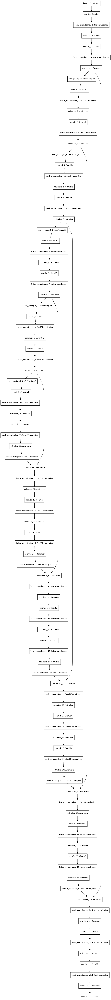
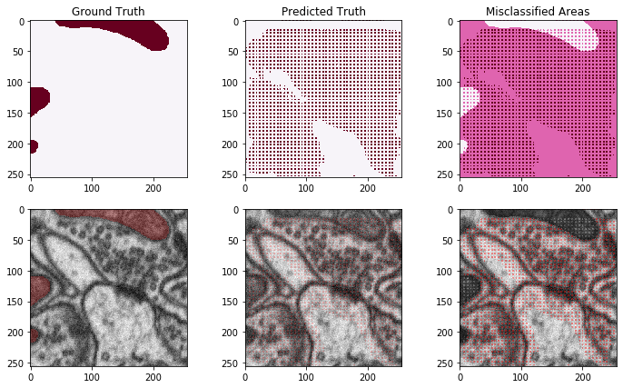

### [Previous: Statistical Inference](https://cemalec.github.io/is_statistical_inference)|[Next: Model Extensions](https://cemalec.github.io/is_model_extensions)

```python
#Import necessary packages
import numpy as np
import matplotlib.pyplot as plt
import tensorflow as tf
import tensorflow.contrib as tfcontrib
from itertools import product
from tensorflow.python.keras import layers
from tensorflow.python.keras import optimizers
from tensorflow.python.keras import losses
from tensorflow.python.keras import models
from tensorflow.python.keras import backend as K
from tensorflow.keras.preprocessing.image import ImageDataGenerator
from scipy.ndimage.interpolation import map_coordinates
```


```python
fullsize_training_inputs = np.load('training_inputs.npy')
fullsize_training_ground_truth = np.load('training_ground_truth.npy')
fullsize_testing_inputs = np.load('testing_inputs.npy')
fullsize_testing_ground_truth = np.load('testing_ground_truth.npy')
```


```python
#Dice the tensor into smaller, square images
def stack_tensor(tensor,num_stack_H,num_stack_W,rotate=False):
    '''
    divides tensor of size (N,H,W,C) into more instances of smaller images (N*n^2,H/n,W/n,C)
    tensor: A four dimensional tensor object or numpy array
    num_stack: number of times to divide width and height
    '''
    #unpack values
    N, H, W, C = tensor.shape
    new_N = N*(num_stack_H*num_stack_W)
    new_H = H//num_stack_H
    new_W = W//num_stack_W
    image_segments = product(range(num_stack_H), range(num_stack_W))
    stacked_tensor = np.empty((new_N,new_H,new_W,C))
    if rotate == True:
        stacked_tensor = np.empty((new_N,new_W,new_H,C))
        tensor = np.swapaxes(tensor,1,2)
        image_segments = product(range(num_stack_W), range(num_stack_H))
        new_H, new_W = new_W, new_H
    new_n=0
    for r, c in image_segments:
        for n in range(N):
            stacked_tensor[new_n,:,:,:] = tensor[n, r*new_H:(r+1)*new_H,c*new_W:(c+1)*new_W,:]
            new_n += 1
    return stacked_tensor

def preprocess_tensor(tensor):
    '''
    Applies common pre-processing transformations and returns the necessary constants 
    to apply the same transforms to validation and test data
    '''
    tensor_mean = np.mean(tensor,axis=0,keepdims=True)
    preprocessed_tensor = tensor - tensor_mean
    return preprocessed_tensor, tensor_mean
```


```python
training_inputs = stack_tensor(fullsize_training_inputs,3,4)/255
training_ground_truth = stack_tensor(fullsize_training_ground_truth,3,4)/255
testing_inputs = stack_tensor(fullsize_testing_inputs,3,4)/255
testing_ground_truth = stack_tensor(fullsize_testing_ground_truth,3,4)/255
input_shape = training_inputs.shape

del fullsize_training_inputs
del fullsize_training_ground_truth
del fullsize_testing_inputs
del fullsize_testing_ground_truth
```


```python
def conv_block(input_tensor, num_filters):
    encoder = layers.Conv2D(filters=num_filters,kernel_size=(3, 3),padding='same')(input_tensor)
    encoder = layers.BatchNormalization()(encoder)
    encoder = layers.Activation('relu')(encoder)
    encoder = layers.Conv2D(filters=num_filters,kernel_size=(3, 3),padding='same')(encoder)
    encoder = layers.BatchNormalization()(encoder)
    encoder = layers.Activation('relu')(encoder)
    return encoder

def encoder_block(input_tensor, num_filters):
    encoder = conv_block(input_tensor, num_filters)
    encoder_pool = layers.MaxPooling2D(pool_size=(2, 2), strides=(2, 2))(encoder)
    return encoder_pool, encoder

def decoder_block(input_tensor, concat_tensor, num_filters):
    decoder = layers.Conv2DTranspose(filters=num_filters,kernel_size=(2, 2),strides=(2, 2),padding='same')(input_tensor)
    decoder = layers.concatenate([concat_tensor, decoder], axis=-1)
    decoder = layers.BatchNormalization()(decoder)
    decoder = layers.Activation('relu')(decoder)
    decoder = layers.Conv2D(filters=num_filters, kernel_size=(3, 3),padding='same')(decoder)
    decoder = layers.BatchNormalization()(decoder)
    decoder = layers.Activation('relu')(decoder)
    decoder = layers.Conv2D(filters=num_filters, kernel_size=(3, 3),padding='same')(decoder)
    decoder = layers.BatchNormalization()(decoder)
    decoder = layers.Activation('relu')(decoder)
    return decoder
```


```python
inputs = layers.Input(shape = (training_inputs.shape[1:]))
# 256

encoder0_pool, encoder0 = encoder_block(inputs, 32)
# 128

encoder1_pool, encoder1 = encoder_block(encoder0_pool, 64)
# 64

encoder2_pool, encoder2 = encoder_block(encoder1_pool, 128)
# 32

encoder3_pool, encoder3 = encoder_block(encoder2_pool, 256)
# 16

encoder4_pool, encoder4 = encoder_block(encoder3_pool, 512)
# 8

center = conv_block(encoder4_pool, 1024)
# center

decoder4 = decoder_block(center, encoder4, 512)
# 16

decoder3 = decoder_block(decoder4, encoder3, 256)
# 32

decoder2 = decoder_block(decoder3, encoder2, 128)
# 64

decoder1 = decoder_block(decoder2, encoder1, 64)
# 128

decoder0 = decoder_block(decoder1, encoder0, 32)
# 256

outputs = layers.Conv2D(1, (1, 1), activation='sigmoid')(decoder0)
```

    WARNING: Logging before flag parsing goes to stderr.
    W1105 14:02:53.700567 11616 deprecation.py:506] From C:\Users\Malec\AppData\Roaming\Python\Python37\site-packages\tensorflow\python\ops\init_ops.py:1251: calling VarianceScaling.__init__ (from tensorflow.python.ops.init_ops) with dtype is deprecated and will be removed in a future version.
    Instructions for updating:
    Call initializer instance with the dtype argument instead of passing it to the constructor


```python
model = models.Model(inputs=[inputs], outputs=[outputs])
model.summary()
```

    Model: "model"
    __________________________________________________________________________________________________
    Layer (type)                    Output Shape         Param #     Connected to                     
    ==================================================================================================
    input_1 (InputLayer)            [(None, 256, 256, 1) 0                                            
    __________________________________________________________________________________________________
    conv2d (Conv2D)                 (None, 256, 256, 32) 320         input_1[0][0]                    
    __________________________________________________________________________________________________
    batch_normalization (BatchNorma (None, 256, 256, 32) 128         conv2d[0][0]                     
    __________________________________________________________________________________________________
    activation (Activation)         (None, 256, 256, 32) 0           batch_normalization[0][0]        
    __________________________________________________________________________________________________
    conv2d_1 (Conv2D)               (None, 256, 256, 32) 9248        activation[0][0]                 
    __________________________________________________________________________________________________
    batch_normalization_1 (BatchNor (None, 256, 256, 32) 128         conv2d_1[0][0]                   
    __________________________________________________________________________________________________
    activation_1 (Activation)       (None, 256, 256, 32) 0           batch_normalization_1[0][0]      
    __________________________________________________________________________________________________
    max_pooling2d (MaxPooling2D)    (None, 128, 128, 32) 0           activation_1[0][0]               
    __________________________________________________________________________________________________
    conv2d_2 (Conv2D)               (None, 128, 128, 64) 18496       max_pooling2d[0][0]              
    __________________________________________________________________________________________________
    batch_normalization_2 (BatchNor (None, 128, 128, 64) 256         conv2d_2[0][0]                   
    __________________________________________________________________________________________________
    activation_2 (Activation)       (None, 128, 128, 64) 0           batch_normalization_2[0][0]      
    __________________________________________________________________________________________________
    conv2d_3 (Conv2D)               (None, 128, 128, 64) 36928       activation_2[0][0]               
    __________________________________________________________________________________________________
    batch_normalization_3 (BatchNor (None, 128, 128, 64) 256         conv2d_3[0][0]                   
    __________________________________________________________________________________________________
    activation_3 (Activation)       (None, 128, 128, 64) 0           batch_normalization_3[0][0]      
    __________________________________________________________________________________________________
    max_pooling2d_1 (MaxPooling2D)  (None, 64, 64, 64)   0           activation_3[0][0]               
    __________________________________________________________________________________________________
    conv2d_4 (Conv2D)               (None, 64, 64, 128)  73856       max_pooling2d_1[0][0]            
    __________________________________________________________________________________________________
    batch_normalization_4 (BatchNor (None, 64, 64, 128)  512         conv2d_4[0][0]                   
    __________________________________________________________________________________________________
    activation_4 (Activation)       (None, 64, 64, 128)  0           batch_normalization_4[0][0]      
    __________________________________________________________________________________________________
    conv2d_5 (Conv2D)               (None, 64, 64, 128)  147584      activation_4[0][0]               
    __________________________________________________________________________________________________
    batch_normalization_5 (BatchNor (None, 64, 64, 128)  512         conv2d_5[0][0]                   
    __________________________________________________________________________________________________
    activation_5 (Activation)       (None, 64, 64, 128)  0           batch_normalization_5[0][0]      
    __________________________________________________________________________________________________
    max_pooling2d_2 (MaxPooling2D)  (None, 32, 32, 128)  0           activation_5[0][0]               
    __________________________________________________________________________________________________
    conv2d_6 (Conv2D)               (None, 32, 32, 256)  295168      max_pooling2d_2[0][0]            
    __________________________________________________________________________________________________
    batch_normalization_6 (BatchNor (None, 32, 32, 256)  1024        conv2d_6[0][0]                   
    __________________________________________________________________________________________________
    activation_6 (Activation)       (None, 32, 32, 256)  0           batch_normalization_6[0][0]      
    __________________________________________________________________________________________________
    conv2d_7 (Conv2D)               (None, 32, 32, 256)  590080      activation_6[0][0]               
    __________________________________________________________________________________________________
    batch_normalization_7 (BatchNor (None, 32, 32, 256)  1024        conv2d_7[0][0]                   
    __________________________________________________________________________________________________
    activation_7 (Activation)       (None, 32, 32, 256)  0           batch_normalization_7[0][0]      
    __________________________________________________________________________________________________
    max_pooling2d_3 (MaxPooling2D)  (None, 16, 16, 256)  0           activation_7[0][0]               
    __________________________________________________________________________________________________
    conv2d_8 (Conv2D)               (None, 16, 16, 512)  1180160     max_pooling2d_3[0][0]            
    __________________________________________________________________________________________________
    batch_normalization_8 (BatchNor (None, 16, 16, 512)  2048        conv2d_8[0][0]                   
    __________________________________________________________________________________________________
    activation_8 (Activation)       (None, 16, 16, 512)  0           batch_normalization_8[0][0]      
    __________________________________________________________________________________________________
    conv2d_9 (Conv2D)               (None, 16, 16, 512)  2359808     activation_8[0][0]               
    __________________________________________________________________________________________________
    batch_normalization_9 (BatchNor (None, 16, 16, 512)  2048        conv2d_9[0][0]                   
    __________________________________________________________________________________________________
    activation_9 (Activation)       (None, 16, 16, 512)  0           batch_normalization_9[0][0]      
    __________________________________________________________________________________________________
    max_pooling2d_4 (MaxPooling2D)  (None, 8, 8, 512)    0           activation_9[0][0]               
    __________________________________________________________________________________________________
    conv2d_10 (Conv2D)              (None, 8, 8, 1024)   4719616     max_pooling2d_4[0][0]            
    __________________________________________________________________________________________________
    batch_normalization_10 (BatchNo (None, 8, 8, 1024)   4096        conv2d_10[0][0]                  
    __________________________________________________________________________________________________
    activation_10 (Activation)      (None, 8, 8, 1024)   0           batch_normalization_10[0][0]     
    __________________________________________________________________________________________________
    conv2d_11 (Conv2D)              (None, 8, 8, 1024)   9438208     activation_10[0][0]              
    __________________________________________________________________________________________________
    batch_normalization_11 (BatchNo (None, 8, 8, 1024)   4096        conv2d_11[0][0]                  
    __________________________________________________________________________________________________
    activation_11 (Activation)      (None, 8, 8, 1024)   0           batch_normalization_11[0][0]     
    __________________________________________________________________________________________________
    conv2d_transpose (Conv2DTranspo (None, 16, 16, 512)  2097664     activation_11[0][0]              
    __________________________________________________________________________________________________
    concatenate (Concatenate)       (None, 16, 16, 1024) 0           activation_9[0][0]               
                                                                     conv2d_transpose[0][0]           
    __________________________________________________________________________________________________
    batch_normalization_12 (BatchNo (None, 16, 16, 1024) 4096        concatenate[0][0]                
    __________________________________________________________________________________________________
    activation_12 (Activation)      (None, 16, 16, 1024) 0           batch_normalization_12[0][0]     
    __________________________________________________________________________________________________
    conv2d_12 (Conv2D)              (None, 16, 16, 512)  4719104     activation_12[0][0]              
    __________________________________________________________________________________________________
    batch_normalization_13 (BatchNo (None, 16, 16, 512)  2048        conv2d_12[0][0]                  
    __________________________________________________________________________________________________
    activation_13 (Activation)      (None, 16, 16, 512)  0           batch_normalization_13[0][0]     
    __________________________________________________________________________________________________
    conv2d_13 (Conv2D)              (None, 16, 16, 512)  2359808     activation_13[0][0]              
    __________________________________________________________________________________________________
    batch_normalization_14 (BatchNo (None, 16, 16, 512)  2048        conv2d_13[0][0]                  
    __________________________________________________________________________________________________
    activation_14 (Activation)      (None, 16, 16, 512)  0           batch_normalization_14[0][0]     
    __________________________________________________________________________________________________
    conv2d_transpose_1 (Conv2DTrans (None, 32, 32, 256)  524544      activation_14[0][0]              
    __________________________________________________________________________________________________
    concatenate_1 (Concatenate)     (None, 32, 32, 512)  0           activation_7[0][0]               
                                                                     conv2d_transpose_1[0][0]         
    __________________________________________________________________________________________________
    batch_normalization_15 (BatchNo (None, 32, 32, 512)  2048        concatenate_1[0][0]              
    __________________________________________________________________________________________________
    activation_15 (Activation)      (None, 32, 32, 512)  0           batch_normalization_15[0][0]     
    __________________________________________________________________________________________________
    conv2d_14 (Conv2D)              (None, 32, 32, 256)  1179904     activation_15[0][0]              
    __________________________________________________________________________________________________
    batch_normalization_16 (BatchNo (None, 32, 32, 256)  1024        conv2d_14[0][0]                  
    __________________________________________________________________________________________________
    activation_16 (Activation)      (None, 32, 32, 256)  0           batch_normalization_16[0][0]     
    __________________________________________________________________________________________________
    conv2d_15 (Conv2D)              (None, 32, 32, 256)  590080      activation_16[0][0]              
    __________________________________________________________________________________________________
    batch_normalization_17 (BatchNo (None, 32, 32, 256)  1024        conv2d_15[0][0]                  
    __________________________________________________________________________________________________
    activation_17 (Activation)      (None, 32, 32, 256)  0           batch_normalization_17[0][0]     
    __________________________________________________________________________________________________
    conv2d_transpose_2 (Conv2DTrans (None, 64, 64, 128)  131200      activation_17[0][0]              
    __________________________________________________________________________________________________
    concatenate_2 (Concatenate)     (None, 64, 64, 256)  0           activation_5[0][0]               
                                                                     conv2d_transpose_2[0][0]         
    __________________________________________________________________________________________________
    batch_normalization_18 (BatchNo (None, 64, 64, 256)  1024        concatenate_2[0][0]              
    __________________________________________________________________________________________________
    activation_18 (Activation)      (None, 64, 64, 256)  0           batch_normalization_18[0][0]     
    __________________________________________________________________________________________________
    conv2d_16 (Conv2D)              (None, 64, 64, 128)  295040      activation_18[0][0]              
    __________________________________________________________________________________________________
    batch_normalization_19 (BatchNo (None, 64, 64, 128)  512         conv2d_16[0][0]                  
    __________________________________________________________________________________________________
    activation_19 (Activation)      (None, 64, 64, 128)  0           batch_normalization_19[0][0]     
    __________________________________________________________________________________________________
    conv2d_17 (Conv2D)              (None, 64, 64, 128)  147584      activation_19[0][0]              
    __________________________________________________________________________________________________
    batch_normalization_20 (BatchNo (None, 64, 64, 128)  512         conv2d_17[0][0]                  
    __________________________________________________________________________________________________
    activation_20 (Activation)      (None, 64, 64, 128)  0           batch_normalization_20[0][0]     
    __________________________________________________________________________________________________
    conv2d_transpose_3 (Conv2DTrans (None, 128, 128, 64) 32832       activation_20[0][0]              
    __________________________________________________________________________________________________
    concatenate_3 (Concatenate)     (None, 128, 128, 128 0           activation_3[0][0]               
                                                                     conv2d_transpose_3[0][0]         
    __________________________________________________________________________________________________
    batch_normalization_21 (BatchNo (None, 128, 128, 128 512         concatenate_3[0][0]              
    __________________________________________________________________________________________________
    activation_21 (Activation)      (None, 128, 128, 128 0           batch_normalization_21[0][0]     
    __________________________________________________________________________________________________
    conv2d_18 (Conv2D)              (None, 128, 128, 64) 73792       activation_21[0][0]              
    __________________________________________________________________________________________________
    batch_normalization_22 (BatchNo (None, 128, 128, 64) 256         conv2d_18[0][0]                  
    __________________________________________________________________________________________________
    activation_22 (Activation)      (None, 128, 128, 64) 0           batch_normalization_22[0][0]     
    __________________________________________________________________________________________________
    conv2d_19 (Conv2D)              (None, 128, 128, 64) 36928       activation_22[0][0]              
    __________________________________________________________________________________________________
    batch_normalization_23 (BatchNo (None, 128, 128, 64) 256         conv2d_19[0][0]                  
    __________________________________________________________________________________________________
    activation_23 (Activation)      (None, 128, 128, 64) 0           batch_normalization_23[0][0]     
    __________________________________________________________________________________________________
    conv2d_transpose_4 (Conv2DTrans (None, 256, 256, 32) 8224        activation_23[0][0]              
    __________________________________________________________________________________________________
    concatenate_4 (Concatenate)     (None, 256, 256, 64) 0           activation_1[0][0]               
                                                                     conv2d_transpose_4[0][0]         
    __________________________________________________________________________________________________
    batch_normalization_24 (BatchNo (None, 256, 256, 64) 256         concatenate_4[0][0]              
    __________________________________________________________________________________________________
    activation_24 (Activation)      (None, 256, 256, 64) 0           batch_normalization_24[0][0]     
    __________________________________________________________________________________________________
    conv2d_20 (Conv2D)              (None, 256, 256, 32) 18464       activation_24[0][0]              
    __________________________________________________________________________________________________
    batch_normalization_25 (BatchNo (None, 256, 256, 32) 128         conv2d_20[0][0]                  
    __________________________________________________________________________________________________
    activation_25 (Activation)      (None, 256, 256, 32) 0           batch_normalization_25[0][0]     
    __________________________________________________________________________________________________
    conv2d_21 (Conv2D)              (None, 256, 256, 32) 9248        activation_25[0][0]              
    __________________________________________________________________________________________________
    batch_normalization_26 (BatchNo (None, 256, 256, 32) 128         conv2d_21[0][0]                  
    __________________________________________________________________________________________________
    activation_26 (Activation)      (None, 256, 256, 32) 0           batch_normalization_26[0][0]     
    __________________________________________________________________________________________________
    conv2d_22 (Conv2D)              (None, 256, 256, 1)  33          activation_26[0][0]              
    ==================================================================================================
    Total params: 31,125,921
    Trainable params: 31,109,921
    Non-trainable params: 16,000
    __________________________________________________________________________________________________


```python
from tensorflow.keras.utils import plot_model

plot_model(model,to_file = 'model_plot.png',rankdir='TB')
```





```python
def dice_coeff(y_true, y_pred):
    smooth = 1.
    # Flatten
    y_true_f = tf.reshape(y_true, [-1])
    y_pred_f = tf.reshape(y_pred, [-1])
    intersection = tf.reduce_sum(y_true_f * y_pred_f)
    score = (2. * intersection + smooth) / (tf.reduce_sum(y_true_f) + tf.reduce_sum(y_pred_f) + smooth)
    return score
```


```python
training_inputs, training_mean = preprocess_tensor(training_inputs)
```


```python
validation_inds = np.random.choice(range(training_inputs.shape[0]),50)
validation_inputs = testing_inputs[validation_inds,:,:,:] - training_mean
validation_ground_truth = testing_ground_truth[validation_inds,:,:,:]
```


```python
#Initiate Adam optimizer with default values
opt = optimizers.Adam()

#Compile model
model.compile(optimizer=opt, 
              loss=losses.binary_crossentropy, 
              metrics=[dice_coeff])

#Some parameters
epochs = 1
batch_size = 10

#Define a model callback
save_model_path = 'tmp/weights_baseline.hdf5'
cp = tf.keras.callbacks.ModelCheckpoint(filepath=save_model_path, 
                                        monitor='val_loss',
                                        save_best_only=True, 
                                        verbose=1)
```


```python
image_datagen = ImageDataGenerator()
mask_datagen = ImageDataGenerator()

train_image_generator = image_datagen.flow(
    training_inputs,
    batch_size=batch_size)

train_mask_generator = mask_datagen.flow(
    training_ground_truth,
    batch_size=batch_size)

train_generator = (pair for pair in zip(train_image_generator,train_mask_generator))
```


```python
#Fit the model
history = model.fit_generator(train_generator,
                    epochs = epochs,
                    steps_per_epoch = training_inputs.shape[0]//batch_size,
                    validation_data =(validation_inputs, validation_ground_truth),
                    shuffle=True,
                    callbacks=[cp]
                   )
```

    197/198 [============================>.] - ETA: 22s - loss: 0.2163 - dice_coeff: 0.0572
    Epoch 00001: val_loss improved from inf to 2.64773, saving model to tmp/weights_baseline.hdf5
    198/198 [==============================] - 4392s 22s/step - loss: 0.2166 - dice_coeff: 0.0573 - val_loss: 2.6477 - val_dice_coeff: 0.0980


```python
#Load best model
model.load_weights(save_model_path)
# Score trained model.
possible_test_inds = [i for i in range(training_inputs.shape[0]) if i not in validation_inds]
test_inds = np.random.choice(possible_test_inds,50,replace=False)
scores = model.evaluate(testing_inputs[test_inds,:,:,:]-training_mean, 
                        testing_ground_truth[test_inds,:,:,:], 
                        verbose=1)

print('Test loss:', scores[0],'\n Dice coefficient:', scores[1])
```

    50/50 [==============================] - 10s 192ms/sample - loss: 2.4291 - dice_coeff: 0.0939
    Test loss: 2.4290732383728026 
     Dice coefficient: 0.093900114


```python
index = 0
_,H,W,_ = testing_inputs.shape
image = testing_inputs[test_inds[index],:,:,0]
predict_mask = np.zeros(shape=(H,W,4))
test_mask = np.zeros(shape=(H,W,4))
oops_mask = np.zeros(shape=(H,W,4))

predict_mask[:,:,0] = model.predict(testing_inputs[test_inds,:,:,:]-training_mean)[index][:,:,0] > 0.5
predict_mask[:,:,3] = 0.2*(predict_mask[:,:,0]>0.)

test_mask[:,:,0] = testing_ground_truth[test_inds[index],:,:,0]
test_mask[test_mask>1] = 1
test_mask[:,:,3] = 0.2*(test_mask[:,:,0]>0.)

oops_mask[:,:,0] = 0.5*(predict_mask[:,:,0] - test_mask[:,:,0])+0.5
oops_mask[:,:,3] = 0.4*((oops_mask[:,:,0]>0.51))+0.4*(oops_mask[:,:,0]<0.49)

fig = plt.figure(figsize=[12,7])
ax1 = plt.subplot(2,3,1)
ax1.imshow(test_mask[:,:,0],cmap='PuRd')
ax1.set_title('Ground Truth')

ax2 = plt.subplot(2,3,2)
ax2.imshow(predict_mask[:,:,0],cmap='PuRd')
ax2.set_title('Predicted Truth')

ax3 = plt.subplot(2,3,3)
ax3.imshow(oops_mask[:,:,0],cmap='PuRd')
ax3.set_title('Misclassified Areas')

ax4 = plt.subplot(2,3,4)
ax4.imshow(image,cmap = 'gray',label='real_image')
ax4.imshow(test_mask,cmap='Reds')

ax5 = plt.subplot(2,3,5)
ax5.imshow(image,cmap = 'gray',label='predicted_image')
ax5.imshow(predict_mask,cmap='Reds')

ax6 = plt.subplot(2,3,6)
ax6.imshow(image,cmap = 'gray',label='mistakes_image')
ax6.imshow(oops_mask,cmap='PuRd')

plt.show()
```



