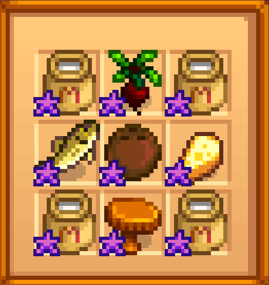

## Stardew Valley Grange Display - Application
Now that I've got an 'ideal' display made up, and I made lofty claims that I had a lot of it on hand, let's see the reality. I want to look at my save file to see what 8 point items I have lying around and which I need to actually aquire. In my current game, I just got the letter from the mayor saying the fair is in one week, so if I bother to figure this out now, I've got 125 points in the bag.

I'll be using lxml's etree (element tree) to navigate the xml of the save file. I've put variables related to my save file's location into a notebook. I'm not too concerned about you all knowing my Farm's name and id, but it's a nice trick for other times when I might want to avoid showing various paths/names/etc from my computer.


```python
%run MyVariables.ipynb
```

    You now have access to the variables farm_name, and farm_path


```python
#import necessary packages
from IPython.display import display, HTML
import pandas as pd
from lxml import etree as ET
```


```python
#open and parse file
with open(farm_path) as file:
    tree = ET.parse(file)
root = tree.getroot()
```


```python
#This is an example of the xml containing information about an item
print(ET.tostring(root.find('player').find('items').findall('Item')[12],pretty_print=True).decode())
```

    <Item xmlns:xsi="http://www.w3.org/2001/XMLSchema-instance" xmlns:xsd="http://www.w3.org/2001/XMLSchema" xsi:type="Object">
      <isLostItem>false</isLostItem>
      <category>-16</category>
      <hasBeenInInventory>true</hasBeenInInventory>
      <name>Clay</name>
      <parentSheetIndex>330</parentSheetIndex>
      <specialItem>false</specialItem>
      <SpecialVariable>0</SpecialVariable>
      <DisplayName>Clay</DisplayName>
      <Name>Clay</Name>
      <Stack>1</Stack>
      <tileLocation>
        <X>0</X>
        <Y>0</Y>
      </tileLocation>
      <owner>0</owner>
      <type>Basic</type>
      <canBeSetDown>true</canBeSetDown>
      <canBeGrabbed>true</canBeGrabbed>
      <isHoedirt>false</isHoedirt>
      <isSpawnedObject>false</isSpawnedObject>
      <questItem>false</questItem>
      <questId>0</questId>
      <isOn>true</isOn>
      <fragility>0</fragility>
      <price>20</price>
      <edibility>-300</edibility>
      <stack>1</stack>
      <quality>0</quality>
      <bigCraftable>false</bigCraftable>
      <setOutdoors>false</setOutdoors>
      <setIndoors>false</setIndoors>
      <readyForHarvest>false</readyForHarvest>
      <showNextIndex>false</showNextIndex>
      <flipped>true</flipped>
      <hasBeenPickedUpByFarmer>true</hasBeenPickedUpByFarmer>
      <isRecipe>false</isRecipe>
      <isLamp>false</isLamp>
      <minutesUntilReady>0</minutesUntilReady>
      <boundingBox>
        <X>0</X>
        <Y>0</Y>
        <Width>64</Width>
        <Height>64</Height>
        <Location>
          <X>0</X>
          <Y>0</Y>
        </Location>
        <Size>
          <X>64</X>
          <Y>64</Y>
        </Size>
      </boundingBox>
      <scale>
        <X>0</X>
        <Y>0</Y>
      </scale>
      <uses>0</uses>
      <preservedParentSheetIndex>0</preservedParentSheetIndex>
      <destroyOvernight>false</destroyOvernight>
    </Item>
    


```python
#helper function to flatten lists of xml elements
def unnest_lists(list_of_lists):
    from functools import reduce
    return reduce(lambda x,y: x+y, list_of_lists,[])

#recursively finds all tags in the tags list in the order they appear, returns a list of elements
def find_tags(parents,tag_list):
    if type(parents) is not list:
        parents = [parents]
    #base case
    if len(tag_list) == 0:
        return [[child for child in parent] for parent in parents]
    #recursive case
    else:
        tag = tag_list.pop(0)
        elements = unnest_lists([element.findall(tag) for element in parents])
        return find_tags(elements,tag_list)

#reads the text within the tags listed in tags, returns None if there is no text within a tag
def read_tags(element_list,tags):
    record = []
    for element in element_list:
        for tag in tags:
            if element.tag == tag:
                text = element.text
                record.append(text)
    if len(record)<len(tags):
        diff = len(tags)-len(record)
        record += diff*[None]
    return record

#displays the tables the way I'd like
def display_table(table_df):
    return display(HTML(table_df.to_html(escape=False,index=False))) #helper function to make it display like I want

```

By general exploration, I found three relevant locations for the items I'm looking for: my active inventory, chests and mini-fridges, and my main fridge. The large fridge that comes with the house is apparently separate from the other chests. I also found that I could not use the object attribute 'chest' to identify relevant chests since this is an attribute for the shipping crate and mini-shipping crate.


```python
#All the objects in all the game locations (Farm, Bus Stop, Ginger Island, etc)
Objects = find_tags(root,['locations','GameLocation','objects','item','value','Object'])
#Names of all the objects
Object_Names = unnest_lists([[element.text for element in Object if element.tag == 'DisplayName'] for Object in Objects])
#Narrow in on container objects
containers = ['Chest','Mini-Fridge','Junimo Chest','Stone Chest']
isContainerObject = [container in containers for container in Object_Names]
Container_Objects = unnest_lists([[Object for Object in Objects[i] if Object.tag=='items'] for i in range(len(Objects)) if isContainerObject[i]])
element_lists = find_tags(Container_Objects,['Item'])
#All the items in all your chests, stone chests, mini-fridges, and junimo chests
items_in_chests = [read_tags(element_list,['Name','price','stack','quality']) for element_list in element_lists]

#These are simpler because items falling under the <player><items>...</items></player> 
#pattern don't include a bunch of items like 'tables' and 'tv'. The same is true for the fridge items

#All the items you're holding right now
active_inventory = find_tags(root,['player','items'])
items_in_inventory = [[read_tags(item,['Name','price','stack','quality']) for item in items] for items in active_inventory]

#Turns out your fridge is its own thing and did not make the cut in chest
fridge = find_tags(root,['locations','GameLocation','fridge','items'])
items_in_fridge = [[read_tags(item,['Name','price','stack','quality']) for item in items] for items in fridge]
```


```python
#Create three dataframes from our list of items
in_chests = pd.DataFrame.from_records(items_in_chests,columns = ['Name','Price','Stack','Quality'])
on_hand = pd.DataFrame.from_records(items_in_inventory[0],columns = ['Name','Price','Stack','Quality'])
in_fridge = pd.DataFrame.from_records(items_in_fridge[0],columns = ['Name','Price','Stack','Quality'])

#Concatenate the dataframes along the row axis, drop empty rows, and set the data types for each column
#Additionally, I'd like the 'stack' column to add together the total amount of each item I have in all chests
all_items = (pd.concat([in_chests,on_hand,in_fridge],axis = 0)
             .dropna()#drop rows with missing columns
             .astype({'Name':str,'Price':int,'Stack':int,'Quality':str})#force correct types on the columns
             .groupby(['Name','Price','Quality'])#groupby non-stack columns
             .sum()#sum the stacks
             .reset_index())#get the groupby columns back out of the index

display_table(all_items.loc[1:200:20,:])#Let's look at a sampling of the dataframe
```


<table border="1" class="dataframe">
  <thead>
    <tr style="text-align: right;">
      <th>Name</th>
      <th>Price</th>
      <th>Quality</th>
      <th>Stack</th>
    </tr>
  </thead>
  <tbody>
    <tr>
      <td>Algae Soup</td>
      <td>100</td>
      <td>0</td>
      <td>2</td>
    </tr>
    <tr>
      <td>Blue Jazz</td>
      <td>50</td>
      <td>1</td>
      <td>2</td>
    </tr>
    <tr>
      <td>Clay</td>
      <td>20</td>
      <td>0</td>
      <td>525</td>
    </tr>
    <tr>
      <td>Crayfish</td>
      <td>75</td>
      <td>0</td>
      <td>4</td>
    </tr>
    <tr>
      <td>Fall Seeds</td>
      <td>45</td>
      <td>0</td>
      <td>30</td>
    </tr>
    <tr>
      <td>Green Algae</td>
      <td>15</td>
      <td>0</td>
      <td>157</td>
    </tr>
    <tr>
      <td>Lucky Lunch</td>
      <td>250</td>
      <td>0</td>
      <td>4</td>
    </tr>
    <tr>
      <td>Oak Resin</td>
      <td>150</td>
      <td>0</td>
      <td>47</td>
    </tr>
    <tr>
      <td>Pumpkin Pie</td>
      <td>385</td>
      <td>0</td>
      <td>1</td>
    </tr>
    <tr>
      <td>Rice Pudding</td>
      <td>260</td>
      <td>0</td>
      <td>1</td>
    </tr>
  </tbody>
</table>


```python
#I now need the dataframe I created earlier
%run Grange_Display.ipynb
display_table(grange_df.head())
```


<table border="1" class="dataframe">
  <thead>
    <tr style="text-align: right;">
      <th>Item</th>
      <th>category</th>
      <th>Price</th>
      <th>Quality</th>
      <th>Points</th>
    </tr>
  </thead>
  <tbody>
    <tr>
      <td>Duck Egg</td>
      <td>Animal Products</td>
      <td>95g</td>
      <td>Base</td>
      <td>3</td>
    </tr>
    <tr>
      <td>Duck Feather</td>
      <td>Animal Products</td>
      <td>250g</td>
      <td>Base</td>
      <td>4</td>
    </tr>
    <tr>
      <td>Egg</td>
      <td>Animal Products</td>
      <td>50g</td>
      <td>Base</td>
      <td>2</td>
    </tr>
    <tr>
      <td>Brown Egg</td>
      <td>Animal Products</td>
      <td>50g</td>
      <td>Base</td>
      <td>2</td>
    </tr>
    <tr>
      <td>Goat Milk</td>
      <td>Animal Products</td>
      <td>225g</td>
      <td>Base</td>
      <td>4</td>
    </tr>
  </tbody>
</table>


So now I have a dataframe with point values for various items, and a dataframe of items I actually have. I would like to join the dataframes to find a list of 8 point items that I actually have. Since the quality columns are formatted differently in the two dataframes, I'll have to fix that.


```python
#Note there are some differences in how the columns are labeled, 
#most importantly quality is numeric in my save file but a string on the wiki
quality_dict = {'0':'Base','1':'Silver','2':'Gold','4':'Iridium'}#map between the two formats
all_items['Quality_str'] = all_items['Quality'].apply(lambda x: quality_dict[x])#relabel my save file quality

#Create a join between the two dataframes, drop columns from join that would be duplicated
my_grange_items = grange_df.merge(all_items.drop(['Price','Quality'],axis=1),
                                  left_on=['Item','Quality'],
                                  right_on=['Name','Quality_str'],
                                  how='inner')#Do an inner join
#display 8 point items I have on hand
display_table(my_grange_items.loc[my_grange_items.Points == 8,['Item','category','Price','Stack']])
```


<table border="1" class="dataframe">
  <thead>
    <tr style="text-align: right;">
      <th>Item</th>
      <th>category</th>
      <th>Price</th>
      <th>Stack</th>
    </tr>
  </thead>
  <tbody>
    <tr>
      <td>Large Milk</td>
      <td>Animal Products</td>
      <td>190g</td>
      <td>6</td>
    </tr>
    <tr>
      <td>Rabbit's Foot</td>
      <td>Animal Products</td>
      <td>565g</td>
      <td>3</td>
    </tr>
    <tr>
      <td>Cheese</td>
      <td>Artisan Goods</td>
      <td>230g</td>
      <td>1</td>
    </tr>
    <tr>
      <td>Flounder</td>
      <td>Fish</td>
      <td>100g</td>
      <td>1</td>
    </tr>
    <tr>
      <td>Walleye</td>
      <td>Fish</td>
      <td>105g</td>
      <td>1</td>
    </tr>
    <tr>
      <td>Beet</td>
      <td>Vegetables</td>
      <td>100g</td>
      <td>1</td>
    </tr>
  </tbody>
</table>


I can see that I've got 4/6 categories with 8 point items, and sufficient iridium quality Large Milk to pad out the display to 9 items. I'm missing forage and fruit. I earlier identified coconuts and certain mushrooms as an easy way to get these.

And sure enough, I threw in an iridium quality chanterelle and coconut and got 125 points on my grange display!


